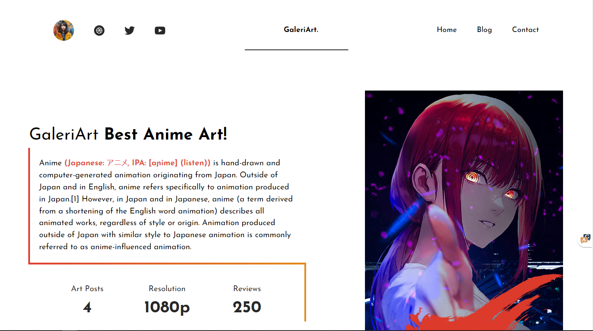

# Astro GaleriArt

```
git clone https://github.com/rakarmp/GaleriArt
```

> 🧑‍🚀 **Seasoned astronaut?** Delete this file. Have fun!



## 🚀 Project Structure

Inside of your Astro project, you'll see the following folders and files:

```
/
├── public/
│   └── favicon.svg
├── src/
│   ├── components/
|   |   |   |-- Utils
|   |   |       |--Scribble.astro
|   |   |-- Form.tsx
|   |   |-- Gallery.astro
|   |   |-- Intro.astro
|   |   |-- Nav.tsx
│   │   └── Testimonials.astro
│   ├── layouts/
│   │   └── main-layout.astro
│   └── pages/
|       |-- contact.astro
│       └── index.astro
└── package.json
```

## 🧞 Commands

All commands are run from the root of the project, from a terminal:

| Command                   | Action                                           |
| :------------------------ | :----------------------------------------------- |
| `npm install`             | Installs dependencies                            |
| `npm run dev`             | Starts local dev server at `localhost:3000`      |
| `npm run build`           | Build your production site to `./dist/`          |
| `npm run preview`         | Preview your build locally, before deploying     |
| `npm run astro ...`       | Run CLI commands like `astro add`, `astro check` |
| `npm run astro -- --help` | Get help using the Astro CLI                     |
